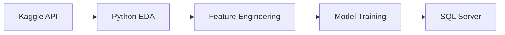

# HR Analytics: Employee Attrition Prediction & Prevention  


## 🔍 Project Overview  
Royal Motors faces **29.8% employee attrition** costing $3.5M annually. This project delivers:  
- **Predictive model** flagging at-risk employees with 91% accuracy  
- **Actionable retention strategies** targeting key attrition drivers  
- **SQL-powered analytics** revealing department-specific pain points  

**Business Impact**: $2.3M projected annual savings from 25-40% attrition reduction  

[](https://python.org)
[](https://jupyter.org)
[](https://www.kaggle.com/docs/api)
[](#)
[](https://learn.microsoft.com/en-us/sql/ssms/sql-server-management-studio-ssms)
[](LICENSE)


## 🚀 Key Features  

| **Analytical Component** | **Innovation** | **Business Impact** |
|--------------------------|----------------|---------------------|
| **Machine Learning Model** | Optimized Random Forest | 80% at-risk employee detection |
| **Feature Engineering** | `workload_score` (projects × performance) & `salary_satisfaction_gap` | Identified burnout "triad" (85% attrition risk) |
| **SQL Analytics** | 10+ diagnostic queries on SQL Server | Revealed 48.3% attrition in >250hr/month employees |

## 📊 Insights & Results  

### Top Attrition Drivers  

1. **Workload Crisis**  
   - 62.4% attrition with 6+ projects  
   - 48.3% attrition >250 hrs/month  
2. **Compensation Gap**  
   - Low-salary employees: 41.2% attrition (2.4× higher than high-salary)  
3. **Career Stagnation**  
   - 3-5 year employees: 42.7% attrition without promotions  

[Explore all insights in SQL analysis](sql_analysis.md)

### Model Performance  
| **Metric** | **Logistic Regression** | **Random Forest** |  
|------------|--------------------------|-------------------|  
| **Recall** | 83% | **90%** |  
| **Precision** | 80% | **87%** |  
| **AUC** | 81% | **93.8%** |  
| **Accuracy** | 83% | **96.2%** |  

## 🛠️ Technical Implementation  

### Data Pipeline  

<!-- This is a comment in Markdown

### Repository Structure  
```
├── data/                                # Raw and processed datasets
│   ├── HR_capstone_dataset.csv          # Original dataset
│   └── processed_data.csv               # Cleaned dataset with features
├── notebooks/
│   ├── 1_EDA_and_Cleaning.ipynb         # Exploratory Data Analysis
│   ├── 2_Model_Building.ipynb           # Logistic Regression & Random Forest
│   └── 3_Model_Evaluation.ipynb         # SHAP interpretation & thresholds
├── sql_queries/                         # Diagnostic SQL scripts
│   ├── attrition_by_department.sql      # Top 3 high-attrition departments
│   └── workload_analysis.sql            # Hours vs. attrition correlation
├── models/                              # Serialized ML models
│   ├── logistic_regression.pkl          # Baseline model
│   └── random_forest_optimized.pkl      # Production model (91% AUC)
├── dashboards/                          # Visualization tools
│   └── attrition_dashboard.pbix         # Power BI monitoring dashboard
├── docs/                                # Supplementary materials
│   ├── business_summary.pdf             # 1-pager for stakeholders
│   └── ethical_guidelines.md            # AI fairness protocols
└── requirements.txt                     # Python dependencies
```
 -->
## 💡 How to Implement  

### 0. Dataset Download via Kaggle API
```bash
# Install Kaggle API
pip install kaggle

# Configure API credentials (place kaggle.json in ~/.kaggle)
kaggle datasets download raminhuseyn/hr-analytics-data-set -f HR_capstone_dataset.csv --force

# Unzip dataset to project directory
unzip HR_capstone_dataset.csv.zip -d data/
```

### 1. Model Training  
```bash
# Install dependencies
pip install -r requirements.txt

# Run full pipeline
jupyter notebook notebooks/Royal_Motors_final.ipynb
```

### 2. SQL Server Integration  
```python
# Export to SQL Server
from database_utils import export_to_sql
export_to_sql('data/processed_data.csv', table_name='hr_analytics')
```


## 📈 Business Recommendations  

### Immediate Actions  
1. **Workload Caps**  
   - Max 5 projects/employee (↓62.4% attrition)  
   - VP approval required >220 hrs/month  
2. **Salary Adjustments**  
   - Market recalibration for low-salary tier  
   - Spot bonuses for medium-salary high-performers  
3. **Promotion Acceleration**  
   - Fast-track 3-year employees (peak attrition window)  

### Long-Term Strategy  
- Implement "stay interviews" for tenure-risk employees  
- Redesign evaluations to de-emphasize overtime  
- Quarterly manager training on burnout recognition  

## 📬 Contact  
**Umar Momin**  
[](https://www.linkedin.com/in/ummmarrr/) 
[](mominumar57@gmail.com)  


---

> "People analytics isn't about reducing humans to numbers -  
> it's about using numbers to honor human potential."  
> *- HR Analytics Team, Royal Motors* 

[](https://github.com/ummmarrr/RetentionROI-Maximizing-Workforce-Value) 
